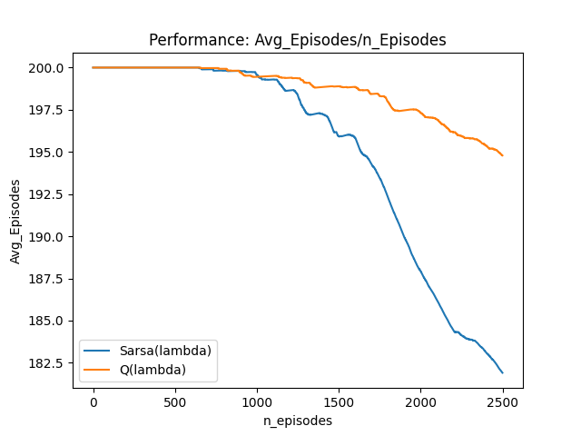

# SARSA-lambda vs Q-lambda for Discrete Action RL
SARSA-lambda and Q-lambda are model-free reinforcement learning algorithms which learn by bootstrapping from the current estimate of the value function.

## Algorithm
Source : 'https://ipvs.informatik.uni-stuttgart.de/mlr/wp-content/uploads/2016/06/03-TemporalDiffHung.pdf'

## Result
* Average Steps in an Epsiode vs No. of Episodes
<p align="left">

* Average Cummulated Reward vs No. of Episodes
<p align="left">

## Dependencies
Install dependencies using:
```bash
pip3 install -r requirements.txt 
```

## Contact
* email: navalekanishk@gmail.com